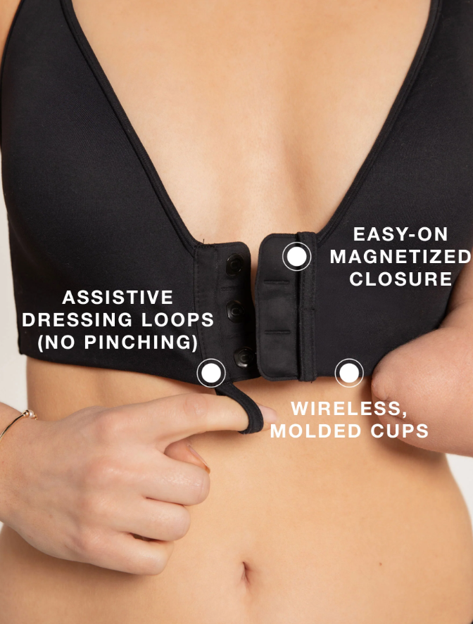
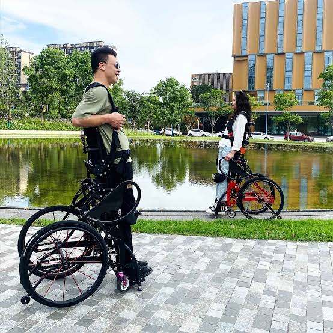

# Aurora San Martín Olivos

## Perfil

**Disciplina / formación:** Ingeniería en Diseño, Universidad Adolfo Ibáñez.
Empecé mis estudios desde el plan común de Ingeniería Civil, lo cual me permitió desarrollarme en un ámbito matemático. Durante mi formación en Ingeniería en Diseño decidí especializarme en la representación visual y la electrónica, siendo ayudante de Modelación 3D, Representación Visual II, Taller de diseño de interfaces, Electrónica aplicada a prototipos y Diseño y construcción de interfaces.

**Qué hago hoy:** Talleres extracurriculares de Modelación 3D y Robótica, School of Makers.

**Qué me gustaría aprender en este curso:** Me gustaría aprender a visualizar información leída con sensores.

## Intereses

- Electrónica y Microcontroladores (Arduino, Raspberry).
- Dibujo, ilustración y creación de personajes.
- Videojuegos.

## Una pregunta que me interesa explorar

¿Cómo visibilizar el efecto de la sobrecarga sensorial que sufren las personas con migraña a personas que no padecen esta patología?

## Algo que me inspira

Me inspira ver el diseño como una forma de ayudar a personas de distintas discapacidades. 

## Links

- [Linkedin](https://www.linkedin.com/in/aurora-san-mart%C3%ADn-olivos/)